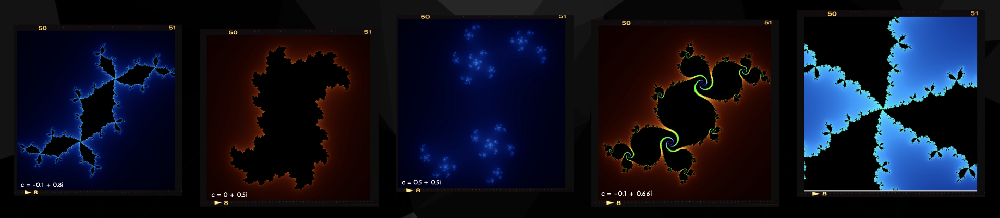
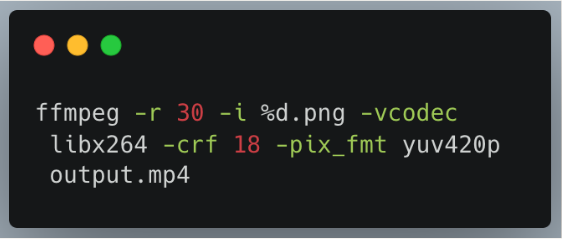
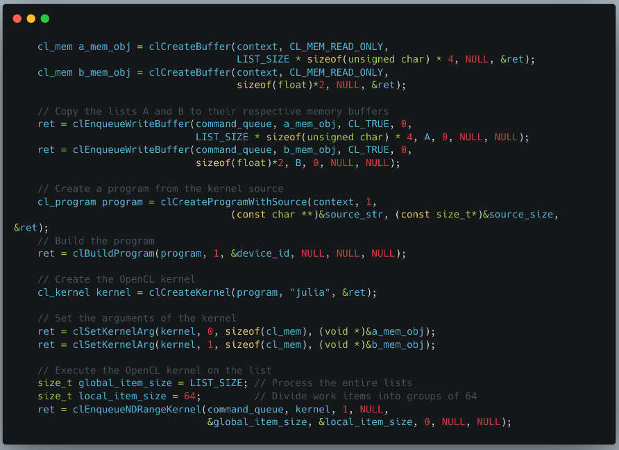
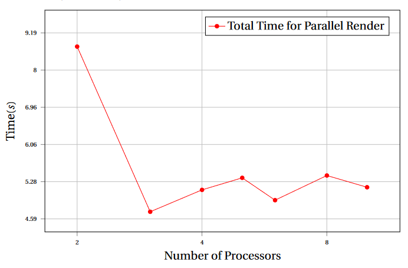
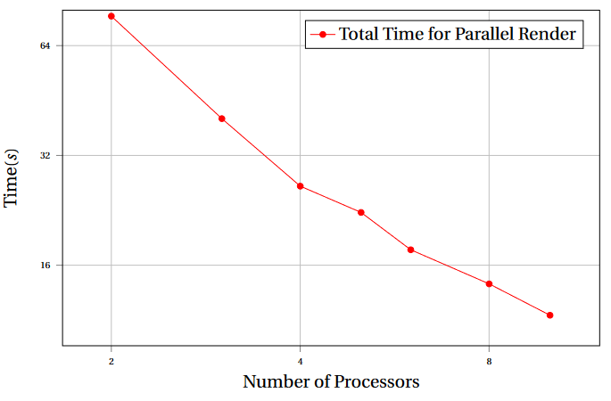
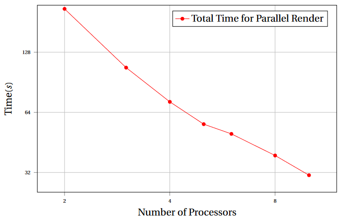

<div align="center">
  
</div>

<br>

<div align="center">


</div>

## Description :pushpin: 
- Parallel programming project to render high-resolution images and videos of Julia sets in C by computing complex functions to plot points. The images are rendered by using OpenCL and OpenGL.

<div align="center">
  
</div>

## Usage :hammer:
>  View <a href="https://docs.scinet.utoronto.ca/index.php/Teach" target="_blank" rel="noreferrer">here</a> to see the system requirements.

```sh 
mpicc video.c -o mpisetup -O3 -lpng && mpirun -np 5 --use-hwthread-cpus ./mpisetup
```
```sh
clang -o main window2.c -lglfw -framework OpenGL -framework OpenCL && ./main
```

## Rendered Images :camera:
<div align="center">
  
</div>

## Introduction :paperclip:
### Purpose
- The purpose of this project is to produce high-resolution pictures of Julia sets using `C/MPI` programming to compute the corresponding points and `OpenGL` to render the pictures.

### Julia Sets
- A type of mathematical set created by plotting complex numbers on a $2D$ graph, where the x and y axes represent the real and imaginary parts of the numbers, respectively. <br>
- Start with a complex number c and then repeatedly apply a function to that number.
- Julia sets are fractal sets that are defined via the iteration of functions such as: 

$$ Q_c(z) = z^2 + c $$ 

$$ T_c(z) = z^3 + c $$

## Implementation :bookmark_tabs:
### MPI: Passing Structs
- When using the `MPI` library for parallel computing in C, passing arrays of pointers to structures can be problematic since the memory of the struct may not be adjacent. This often requires the use of a buffer or the individual sending of pointers. Passing structs instead can be a more straightforward approach to organizing data. However, it’s important to note that structs may contain padding, which needs to be handled appropriately. While using buffers like `Flatbuffers` or `Protobuffers` can be a solution, they require the use of external frameworks and can be challenging to implement.

  
```cpp
typedef struct _Block {
    int size;
    int place; 
    int width; 
    int height;
    png_byte **data;
} Block;

```
### PNG Library
- The PNG file format was chosen due to its lossless nature and ability to compress image files without compromising image quality. Saving images in PNG format can significantly reduce the file size compared to other formats. The PNG format allows for varying levels of compression, which impacts both the size of the output file and the time required to compute it. While higher compression can produce smaller files, the returns diminish at the highest compression levels. Standard PNG libraries are available that can make code portable and quick to develop, making PNG a viable option for image compression in a variety of applications.

### Load Balancing
- For load balancing, we initially distributed work to all processes from the main process. All data was passed using a ’Block’ with a variable name ’knapsack.’ This knapsack contains important values such as the `size` of the block, `place`, `width`, `height`, `is_done` flag, and others. Once the data was distributed, the main process went into the waiting state and waited for a completed process to send back the computed data. The message passing time was significantly shorter than the compute time, so the processes did not spend much time idle while waiting to send back the computed arrays.

#### Load Balancing for Frame Generation
- The process of generating frames involved a master-slave approach where processes were assigned a frame number and a starting value to generate. Upon completion of a frame, the process, $Pn$, communicated with the main process and requested the generation of another frame. The generated frames were saved to disk by each process with its respective frame number as the filename. To combine all frames into a video, an FFMpeg script was used, which added compression based on user-defined parameters such as `Bitrate`, `Codec`, `Frame Rate`, and `Resolution`, among others. This approach facilitated the efficient generation and storage of frames for video production.

<div align="center">
  
</div>

### OpenCL & GPU Computing
#### Why?
- Used in various applications such as scientific simulations, computer vision, image and signal processing, machine learning, and gaming.
- Supported by major hardware vendors, including AMD, Intel, NVIDIA, and ARM.
- Used OpenCL over CUDA due to wider compatibility (MacOS, AMD Hardware).
- Can easily be compiled using CLANG with most systems having OpenCL pre-install.
- Allows for bytes of data to be sent to processes in size of $2n$. Our implementation sends $4$ bytes (RGBA) to each block with each block being size $64$.
- Memory allocation and message passing time is extremely low. Message passing, initialization, compute, and dumping to frame buffer takes approximately $10 - 20 ms$.

#### Kernel Setup
<div align="center">
  
</div>

### OpenGL
#### Why?
- Provides a set of functions and commands that allow developers to access the graphics hardware and render images on the screen.
- Available on a wide range of operating systems, including Windows, macOS, Linux, Android, iOS, and more.
Low-level API - have to manage a lot of the graphics pipeline themselves, including tasks such as memory management, texture mapping, and shader programming.
- A frame buffer is initialized and computed data is dumped. A screen buffer is also initialized and once the frame buffer is ready they are swapped. This allows for data to be dumped while a frame is being created.

## Benchmarks :chart_with_upwards_trend:
### Per-System Benchmark
#### Local System
- Specs: 
  - Macbook Pro 16" (2019) Core i7-9750H
  - Six (6) cores and 16 GB of 2666 MHz DDR4 SDRAM
  - AMD Radeon Pro 5300M GPU with 4GB of GDDR6 memory
- Results:
  - OpenCL version provides real-time display of julia sets with frame generation taking $10 - 15 ms$ at $1080p$ resolution.
  - MPI to generate video runs at approximately $300 ms$ per frame at $4k$ resolution.
  - PNG lib saves image of $50,000\times50,000$ pixels in approximately $45 s$ with filters and compression lowered modestly.
  - Passing messages of block size $1000$ is usually under $10 ms$.
  
#### Teach Cluster System
- Specs: 
  - Teach SciNet cluster
  - 42 repurposed x86_64 nodes each with 16 cores (from two octal core Intel XeonSandy-bridge E5-2650 CPUs) 
  - Runs at 2.0GHz with 64GB of RAM per node
- Results:
  - $10,000\times10,000$ pixels
   
    
  - $30,000\times30,000$ pixels
   
    
  - $50,000\times50,000$ pixels
   